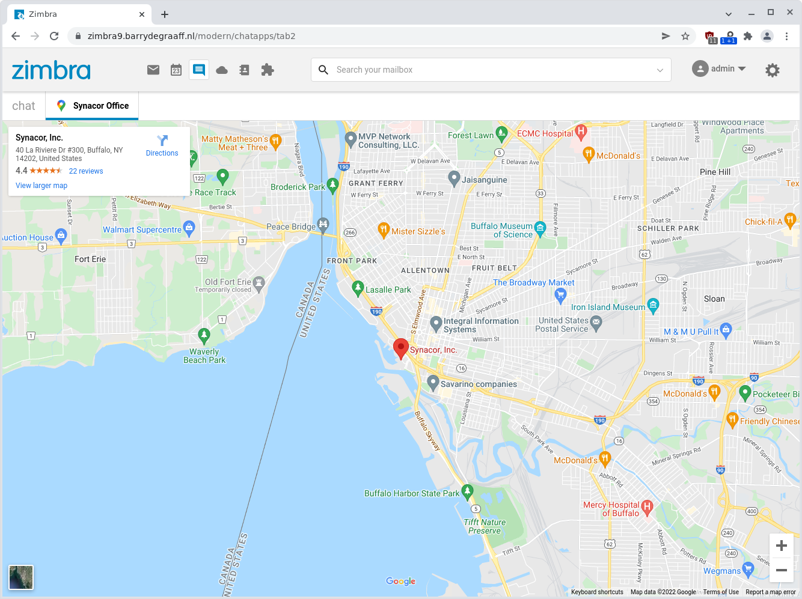
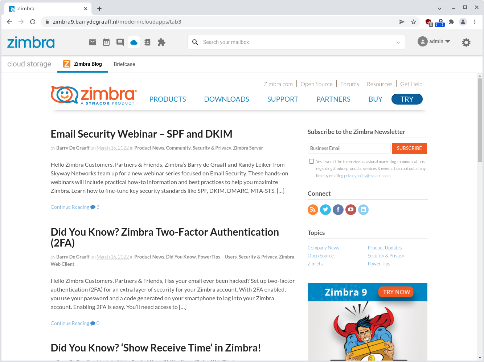
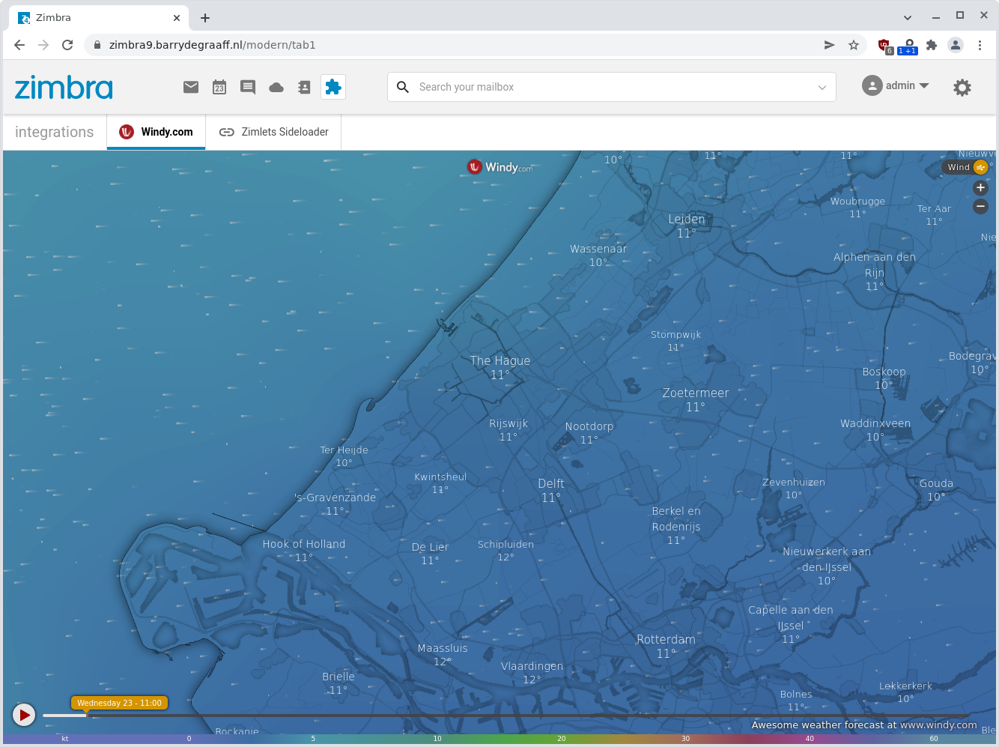

# Integrate 3rd party web-apps in Zimbra with the AnyFrame Zimlet

Integration with Zimbra is easy with the AnyFrame Zimlet. This Zimlet allows you to embed up to 3 websites as a tab in Zimbra Modern UI. You can even choose where you want the integrations to appear in the UI. And you can also limit the visibility of the tabs on a per domain or class of service (CoS) basis.

To install the Zimlet you can download it to your server and run the following command as user zimbra:

```
zmzimletctl deploy zimbra-zimlet-anyframe.zip 
```

To configure the Zimlet create a file /tmp/config_template.xml with the following content:

```xml
<zimletConfig name="zimbra-zimlet-anyframe" version="0.0.1">
    <global>
        <property name="tab1">{"url":"https://embed.windy.com/?52.032,4.310,11","icon":"https://www.windy.com/favicon.ico","name":"Windy.com","route":"/","allowDomains":"", "allowCOSID":""}</property>
        <property name="tab2">{"url":"https://www.google.com/maps/embed?pb=!1m18!1m12!1m3!1d46800.96020851833!2d-78.87109739351685!3d42.85046597320593!2m3!1f0!2f0!3f0!3m2!1i1024!2i768!4f13.1!3m3!1m2!1s0x89d31234c99a4875%3A0x57bea679387ecece!2sSynacor%2C%20Inc.!5e0!3m2!1sen!2snl!4v1648024277172!5m2!1sen!2snl","icon":"https://www.google.com/images/branding/product/ico/maps15_bnuw3a_32dp.ico","name":"Synacor Office","route":"/chatapps/","allowDomains":"", "allowCOSID":""}</property>
        <property name="tab3">{"url":"https://blog.zimbra.com/","icon":"https://www.zimbra.com/wp-content/uploads/2019/05/Zimbra_favicon_144x144.png","name":"Zimbra Blog","route":"/cloudapps/","allowDomains":"", "allowCOSID":""}</property>
    </global>
</zimletConfig>
```

You can configure up to 3 custom integration tabs via the properties tab1, tab2 and tab3. If you only need one tab, just leave the properties for the other tabs emtpy like this:

```xml
<property name="tab3"></property>
```

Each tab you want to use has to be configured via JSON, please note that you have to include all JSON properties, even if you do not use them:

```json
{
  "url": "https://blog.zimbra.com/",
  "icon": "https://www.zimbra.com/wp-content/uploads/2019/05/Zimbra_favicon_144x144.png",
  "name": "Zimbra Blog",
  "route": "/cloudapps/",
  "allowDomains": "",
  "allowCOSID": ""
}
```

Here are the JSON properties explained:

| Property | Description |
|---|---|
| url | url of the website to be displayed in a tab |
| icon | url to the icon to be displayed on the tab |
| name | name to be displayed on the tab  |
| route | choose between `/`, `/cloudapps/` or `/chatapps/` to display the tab under the puzzle, cloud or chat vertical  |
| allowDomains |  comma separated list of domains to allow or empty to allow for all  |
| allowCOSID | comma separated list of Zimbra CoS ID's to allow or empty to allow for all |

To configure the AnyFrame Zimlet with your custom tabs run the following command as user zimbra:

```
zmzimletctl configure config_template.xml 
zmmailboxdctl restart
```

## How to get CoS ID

Run the following commands as user zimbra to list all CoS on your server and find the ID.

```
zimbra@zimbra9:~$ zmprov gac
default
defaultExternal
zimbra@zimbra9:~$ zmprov gc default zimbraId
# name default
zimbraId: e00428a1-0c00-11d9-836a-000d93afea2a
```

## Screenshots


*Custom tab in the Chat Apps vertical.*


*Custom tab in the Cloud Apps vertical.*


*Custom tab in the Integrations vertical.*
